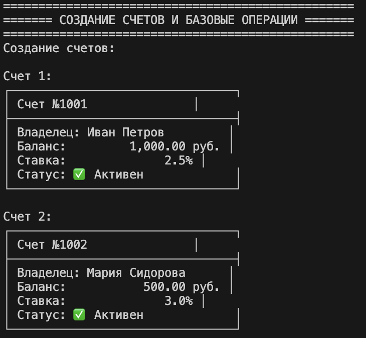
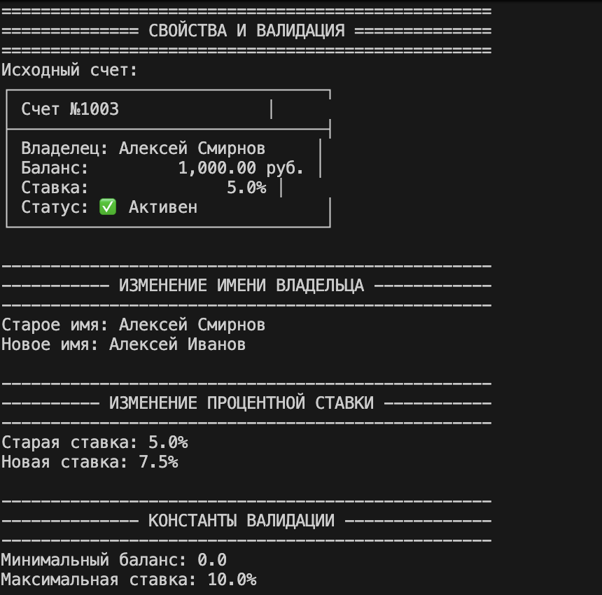
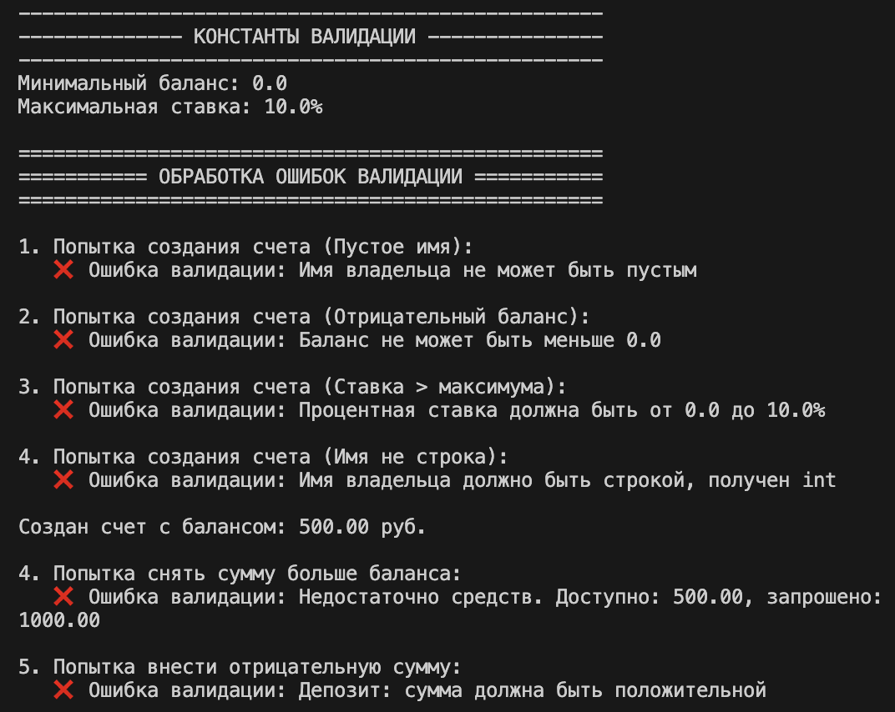
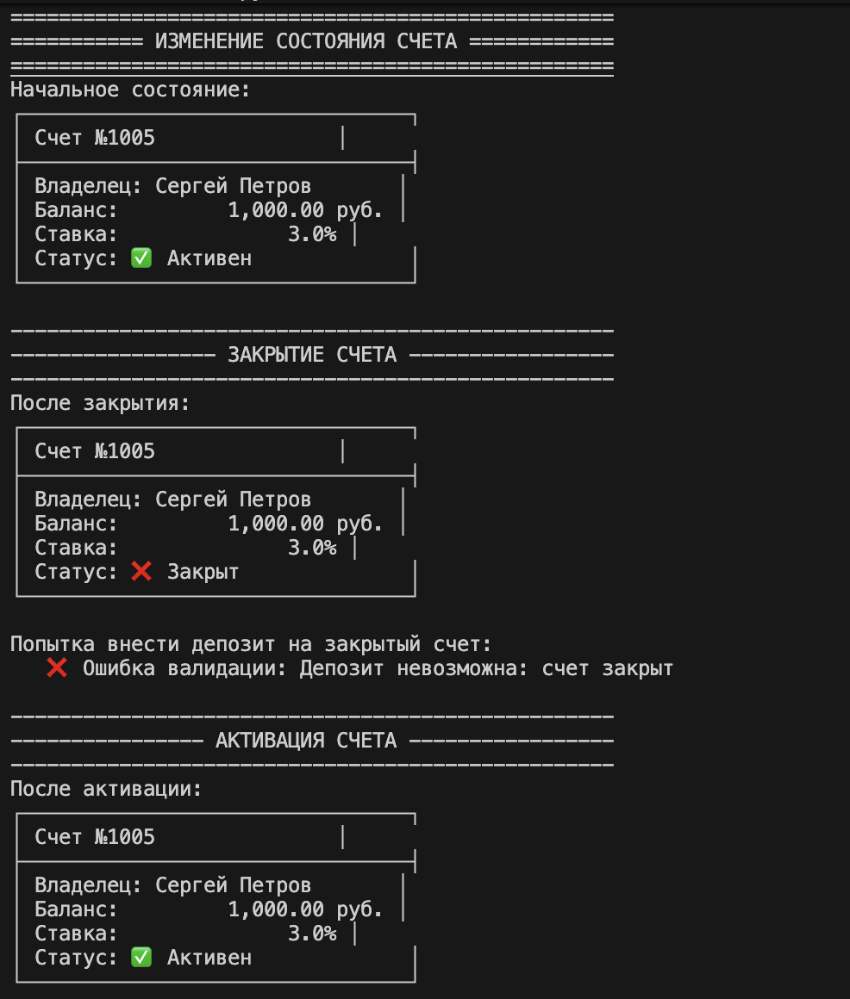

# python_labs2

## Лабораторная работа 1
## Тема
Банковская система — класс BankAccount

## Цель работы
Освоить объявление пользовательских классов, разобраться с инкапсуляцией, реализовать свойства и магические методы.

### model.py 

**`model.py`** — главный файл лабораторной. Реализует:
- Класс `BankAccount` с закрытыми атрибутами
- Свойства (`@property`) для доступа к данным
- Бизнес-методы (операции со счетом)
- Магические методы `__str__`, `__repr__`, `__eq__`

### validate.py
**`validate.py`** — отдельный модуль с логикой проверки данных (валидация имени, баланса, процентной ставки, статуса счета).

### demo.py

**`demo.py`** — демонстрационный файл. Показывает:
- Создание счетов и базовые операции
- Работу свойств и валидации
- Обработку ошибок (try/except)
- Изменение состояния счета (активен/закрыт)
- Сравнение и сортировку объектов
- Переводы между счетами

### Сценарий 1: Демонстрация модуля валидации
**Функция:** `demonstrate_validation_module()`

В этом сценарии показывается работа отдельного модуля `validate.py`:
- Проверка корректных данных (имя, баланс, ставка)
- Проверка некорректных данных с обработкой ошибок
- Демонстрация всех методов валидации

*Работа модуля валидации: проверка корректных и некорректных данных*
## Демонстрация работы

В файле `demo.py` демонстрируются:
1. Создание счетов с различными параметрами
2. Выполнение операций (депозит, снятие, начисление процентов)
3. Работа свойств и валидации
4. Обработка ошибочных ситуаций через try/except
5. Изменение состояния счета (активация/закрытие)
6. Сравнение и сортировка объектов
7. Переводы между счетами

### Сценарий 2: Создание счетов и базовые операции
**Функция:** `demonstrate_creation_and_basic_operations()`

Демонстрируется:
- Создание двух счетов с разными параметрами
- Внесение депозита
- Снятие средств
- Начисление процентов

*Создание счетов и выполнение базовых операций*

### Класс Validator
Статические методы для базовой валидации:
- `validate_owner_name(name)` — проверка имени владельца
- `validate_balance(balance)` — проверка баланса
- `validate_interest_rate(rate)` — проверка процентной ставки
- `validate_positive_amount(amount)` — проверка положительности суммы
- `validate_account_status(is_active)` — проверка активности счета
- `validate_sufficient_balance(balance, amount)` — проверка достаточности средств

### Сценарий 3: Работа свойств и валидации
**Функция:** `demonstrate_properties_and_validation()`

Показывается:
- Изменение имени владельца через setter с валидацией
- Изменение процентной ставки
- Демонстрация констант валидации

*Работа свойств: изменение имени и процентной ставки* 

### Валидация данных
Процесс проверки корректности входных данных:
- Проверка типа данных (число, строка)
- Проверка диапазона (положительное число, не больше максимума)
- Проверка логической корректности (достаточно средств на счете)

### Сценарий 4: Обработка ошибок
**Функция:** `demonstrate_error_handling()`

Демонстрируется обработка различных ошибочных ситуаций:
- Попытка создания счета с пустым именем
- Попытка создания с отрицательным балансом
- Попытка создания со ставкой больше максимума
- Попытка снятия суммы больше баланса
- Попытка внесения отрицательной суммы

*Обработка ошибок через try/except*

### Сценарий 5: Изменение состояния счета
**Функция:** `demonstrate_state_changes()`

Показывается:
- Начальное состояние (счет активен)
- Закрытие счета методом `close_account()`
- Попытка операции с закрытым счетом
- Активация счета методом `activate_account()`
- Успешная операция после активации

*Изменение состояния счета: закрытие и активация*

## Теория

### Класс и объект
**Класс** — это шаблон для создания объектов. Он определяет структуру и поведение будущих объектов.
**Объект (экземпляр)** — конкретная реализация класса, обладающая своими данными.

### Инкапсуляция
Это принцип сокрытия внутренних данных объекта от прямого доступа извне. В Python реализуется через:
- Защищенные поля с одним подчеркиванием: `_balance`
- Приватные поля с двумя подчеркиваниями: `__pin`

Доступ к данным осуществляется через специальные методы.

### Свойства @property
Механизм, позволяющий управлять доступом к атрибутам:
- **Геттер** — для чтения значения
- **Сеттер** — для установки значения с проверкой
- **Делитер** — для удаления атрибута

### Магические методы
Специальные методы с двумя подчеркиваниями в начале и конце:
- `__init__` — конструктор, вызывается при создании объекта
- `__str__` — строковое представление для пользователей
- `__repr__` — официальное представление для разработчиков
- `__eq__` — определяет поведение оператора ==
- `__lt__` — определяет поведение оператора < (для сортировки)

### Атрибуты класса и экземпляра
**Атрибуты класса** — принадлежат самому классу, общие для всех объектов.
**Атрибуты экземпляра** — принадлежат конкретному объекту, у каждого объекта свои значения.

### Состояние объекта
Объект может находиться в разных состояниях (активен/закрыт), которые влияют на доступность операций.

## Класс BankAccount

### Атрибуты (закрытые)
- `_account_number` — номер счета (генерируется автоматически)
- `_owner_name` — имя владельца счета
- `_balance` — текущий баланс
- `_interest_rate` — процентная ставка
- `_is_active` — статус счета (активен/закрыт)

### Атрибут класса
- `_next_account_number` — счетчик для генерации уникальных номеров счетов

### Свойства
- `account_number` — только для чтения
- `balance` — только для чтения
- `owner_name` — чтение и запись с валидацией
- `interest_rate` — чтение и запись с валидацией
- `is_active` — только для чтения

### Магические методы
- `__str__` — красивое отображение счета для пользователя
- `__repr__` — представление для разработчиков (отладка)
- `__eq__` — сравнение счетов по номеру
- `__lt__` — сравнение по балансу (для сортировки)

### Бизнес-методы
- `deposit(amount)` — внесение средств на счет
- `withdraw(amount)` — снятие средств со счета
- `apply_interest()` — начисление процентов на остаток
- `transfer_to(target_account, amount)` — перевод средств на другой счет
- `close_account()` — закрытие счета
- `activate_account()` — активация счета

### Класс TransactionValidator
Специализированные методы для комплексной проверки транзакций:
- `validate_deposit(account, amount)` — проверка депозита
- `validate_withdrawal(account, amount)` — проверка снятия
- `validate_transfer(sender, receiver, amount)` — проверка перевода

## Вывод
В ходе лабораторной работы реализован класс `BankAccount` с инкапсуляцией, свойствами `@property`, магическими методами и бизнес-логикой. Валидация вынесена в отдельный модуль. Цели работы достигнуты.