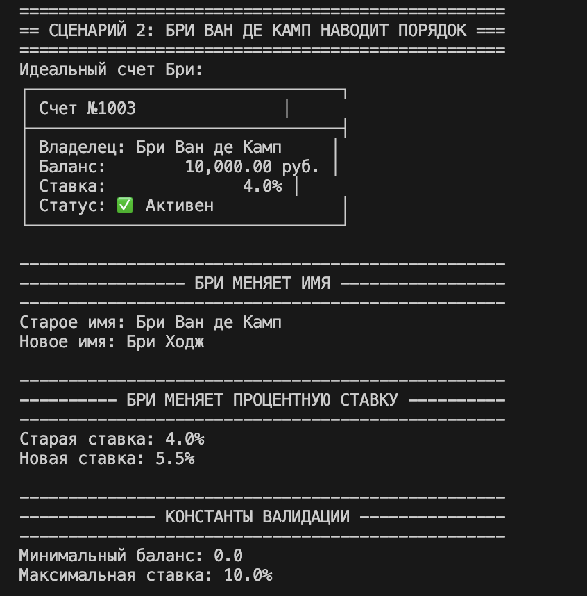

# python_labs2

## Лабораторная работа 1
## Тема
Банковская система — класс BankAccount

## Цель работы
Освоить объявление пользовательских классов, разобраться с инкапсуляцией, реализовать свойства и магические методы.

## Описание файлов лабораторной работы

### model.py 
**`model.py`** — главный файл лабораторной. Реализует:
- Класс `BankAccount` с закрытыми атрибутами
- Свойства (`@property`) для доступа к данным
- Бизнес-методы (операции со счетом)
- Магические методы `__str__`, `__repr__`, `__eq__`

### validate.py
**`validate.py`** — отдельный модуль с логикой проверки данных. Содержит классы `Validator` и `TransactionValidator` для валидации имени, баланса, процентной ставки, статуса счета и транзакций.

### demo.py
**`demo.py`** — демонстрационный файл, содержащий 4 сценария, которые показывают все возможности класса. Каждый сценарий реализован в отдельной функции.

## Демонстрационные сценарии
## Сценарий 1: Инициализация объектов и базовые бизнес-операции
**Функция в demo.py:** `scenario_1_creation_and_basic_operations()`

Демонстрируется создание экземпляров класса и выполнение основных бизнес-операций:
- Инициализация объектов с различными параметрами
- Внесение средств (депозит)
- Снятие средств
- Начисление процентов

### Теория к сценарию:

**Конструктор `__init__`** — специальный метод, который автоматически вызывается при создании объекта. Он инициализирует атрибуты экземпляра и может содержать начальную валидацию данных

**Бизнес-методы** — это методы класса, которые реализуют основную логику предметной области. В банковской системе к ним относятся операции пополнения счета, снятия средств и начисления процентов. Бизнес-методы изменяют внутреннее состояние объекта (баланс) и содержат проверки корректности выполнения операций.

**Конструктор класса** — специальный метод, автоматически вызываемый при создании объекта. Он инициализирует начальные значения атрибутов и может содержать первичную проверку входных данных. Конструктор гарантирует, что объект создается в корректном состоянии.

**Принцип работы бизнес-методов:**
- Метод пополнения увеличивает баланс на указанную сумму после проверки корректности операции
- Метод снятия уменьшает баланс только при наличии достаточных средств
- Метод начисления процентов рассчитывает и добавляет сумму процентов исходя из текущей ставки

## Сценарий 2: Инкапсуляция и управление доступом к атрибутам
**Функция в demo.py:** `scenario_2_properties_and_validation()`

Демонстрируется работа механизма инкапсуляции:
- Геттеры для чтения защищенных полей
- Сеттеры с валидацией входных данных
- Изменение имени владельца и процентной ставки
- Атрибуты класса (константы валидации)

*Создание счетов и выполнение базовых операций*

#### Теория к сценарию:

**Инкапсуляция** — фундаментальный принцип объектно-ориентированного программирования, заключающийся в сокрытии внутренних данных объекта от прямого доступа извне. В Python инкапсуляция реализуется через использование защищенных (с одним подчеркиванием) и приватных (с двумя подчеркиваниями) полей. Это предотвращает некорректное изменение данных и обеспечивает контроль над состоянием объекта.

**Свойства (@property)** — механизм Python, который позволяет управлять доступом к атрибутам объекта. Свойства делятся на три типа:
- **Геттеры** — методы для чтения значений защищенных полей
- **Сеттеры** — методы для установки значений с возможностью валидации
- **Делитеры** — методы для удаления атрибутов (используются реже)

**Валидация данных в сеттерах** — процесс проверки корректности новых значений перед их присвоением. Основные виды проверок:
- Проверка типа данных (строка, число, булево значение)
- Проверка диапазона значений (процентная ставка должна быть в допустимых пределах)
- Проверка на пустоту (имя владельца не может быть пустой строкой)
- Проверка формата (соответствие шаблону)

**Атрибуты класса** — переменные, принадлежащие самому классу, а не его экземплярам. Они являются общими для всех объектов класса и часто используются для хранения констант, счетчиков или общих настроек. Доступ к атрибутам класса возможен как через имя класса, так и через любой экземпляр.

## Сценарий 3: Управление состоянием объекта и обработка исключений
**Функция в demo.py:** `scenario_3_state_changes_and_errors()`

Демонстрируется изменение состояния объекта и обработка исключений:
- Закрытие счета (`close_account`)
- Активация счета (`activate_account`)
- Поведение, зависящее от состояния
- Обработка ошибочных ситуаций через try/except
- Валидация при создании и выполнении операций

*Работа свойств: изменение имени и процентной ставки* 

#### Теория к сценарию:

**Состояние объекта** — совокупность значений всех его атрибутов в конкретный момент времени. Состояние определяет, как объект будет реагировать на вызовы методов. В банковском счете ключевым состоянием является активность счета — открыт он или закрыт для операций.

**Методы изменения состояния** — специальные методы, предназначенные для перевода объекта из одного состояния в другое. Они обеспечивают контролируемое изменение важных атрибутов, влияющих на поведение объекта. Например, закрытие счета делает невозможными операции снятия и пополнения.

**Поведение, зависящее от состояния** — ключевая концепция ООП, при которой методы объекта работают по-разному в зависимости от текущего состояния. Это позволяет моделировать реальные объекты, которые меняют свое поведение при изменении условий. В банковской системе операции депозита и снятия доступны только для активных счетов.

**Обработка исключений (try/except)** — механизм управления ошибками, возникающими во время выполнения программы. Он позволяет:
- Перехватывать исключения определенных типов
- Предоставлять пользователю понятные сообщения об ошибках
- Продолжать выполнение программы после ошибки
- Логировать проблемы для последующего анализа

**Виды валидации в приложении:**
- Входная валидация — проверка данных при создании объекта
- Валидация операций — проверка возможности выполнения действия
- Валидация состояния — проверка корректности состояния объекта для операции

## Сценарий 4: Магические методы и взаимодействие объектов
**Функция в demo.py:** `scenario_4_magic_methods_and_transfer()`

Демонстрируется работа магических методов и взаимодействие объектов:
- `__str__` — пользовательское представление
- `__repr__` — представление для разработчиков
- `__eq__` — сравнение объектов по номеру счета
- `__lt__` — сортировка по балансу
- Перевод средств между счетами (`transfer_to`)
- Комплексная валидация транзакций

#### Теория к сценарию:

**Магические методы (dunder methods)** — специальные методы в Python, имена которых начинаются и заканчиваются двумя подчеркиваниями. Они определяют поведение объектов при использовании встроенных операций и функций:

- **`__str__`** — вызывается функциями `print()` и `str()`, предназначен для создания "человекочитаемого" представления объекта. Используется для вывода информации пользователю.

- **`__repr__`** — вызывается функцией `repr()` и в интерактивной среде, предназначен для создания однозначного представления объекта, по которому его можно восстановить. Используется для отладки.

- **`__eq__`** — определяет поведение оператора сравнения `==`. Позволяет задать логику сравнения двух объектов, например, по уникальному номеру счета.

- **`__lt__`** — определяет поведение оператора `<`, что позволяет сортировать объекты по заданному критерию, например, по балансу.

**Взаимодействие объектов** — способность объектов одного класса работать друг с другом. В банковской системе это реализовано через метод перевода средств, который:
- Принимает целевой счет и сумму перевода
- Проверяет возможность операции для обоих счетов
- Выполняет снятие со счета отправителя
- Выполняет пополнение счета получателя

**Комплексная валидация транзакций** — многоступенчатая проверка перед выполнением перевода:
- Проверка активности счета отправителя
- Проверка активности счета получателя
- Проверка положительности суммы перевода
- Проверка достаточности средств у отправителя
- Проверка корректности объекта-получателя

## Общая теория

  

### Класс и объект
**Класс** — это шаблон или чертеж для создания объектов. Он определяет, какие данные (атрибуты) будет содержать объект и какие действия (методы) он сможет выполнять. Класс описывает общую структуру, но не хранит конкретные данные.
git 
**Объект (экземпляр класса)** — конкретная реализация класса, обладающая собственными значениями атрибутов. Каждый объект существует независимо и может находиться в своем уникальном состоянии.

### Инкапсуляция
Инкапсуляция — один из трех основных принципов ООП (наряду с наследованием и полиморфизмом). Она предполагает объединение данных и методов их обработки внутри класса и сокрытие внутренней реализации от внешнего мира. Преимущества инкапсуляции:
- Защита данных от некорректного использования
- Сокрытие сложности реализации
- Возможность изменять внутреннюю логику без влияния на внешний код
- Повышение надежности и безопасности программы

В Python инкапсуляция реализуется через соглашения об именах, а не через строгие модификаторы доступа как в других языках.

### Свойства @property
Декоратор `@property` позволяет определить метод, который можно использовать как атрибут. Это дает следующие преимущества:
- Сохранение простого синтаксиса доступа к атрибутам
- Возможность добавить логику при чтении значения
- Возможность контролировать изменение значения через сеттер
- Обратная совместимость при изменении внутренней реализации

### Атрибуты класса и экземпляра
**Атрибуты класса** определяются на уровне класса и являются общими для всех экземпляров. Они существуют в единственном экземпляре и доступны даже без создания объекта. Используются для хранения констант, счетчиков и общих настроек.

**Атрибуты экземпляра** определяются в методе `__init__` и создаются для каждого нового объекта индивидуально. Каждый объект имеет собственные копии этих атрибутов с уникальными значениями.

### Валидация данных
Валидация — процесс проверки соответствия данных заданным требованиям. В программных системах валидация необходима для:
- Предотвращения ошибок выполнения
- Обеспечения целостности данных
- Защиты от некорректного ввода
- Поддержания бизнес-правил

В проекте валидация вынесена в отдельный модуль `validate.py`, что обеспечивает чистоту кода, возможность повторного использования и упрощает тестирование.

## Вывод
В ходе лабораторной работы реализован класс `BankAccount` с инкапсуляцией, свойствами `@property`, магическими методами и бизнес-логикой. Создано 4 демонстрационных сценария, каждый из которых показывает определенные аспекты работы класса:
1. **Сценарий 1** — базовые операции и работа конструктора
2. **Сценарий 2** — инкапсуляция и управление доступом к атрибутам
3. **Сценарий 3** — управление состоянием объекта и обработка ошибок
4. **Сценарий 4** — магические методы и взаимодействие объектов

Валидация данных вынесена в отдельный модуль `validate.py`. Все требования лабораторной работы выполнены, цели достигнуты.