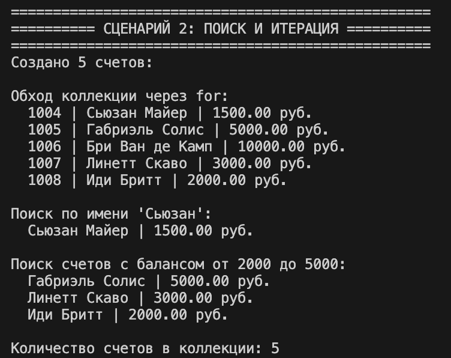
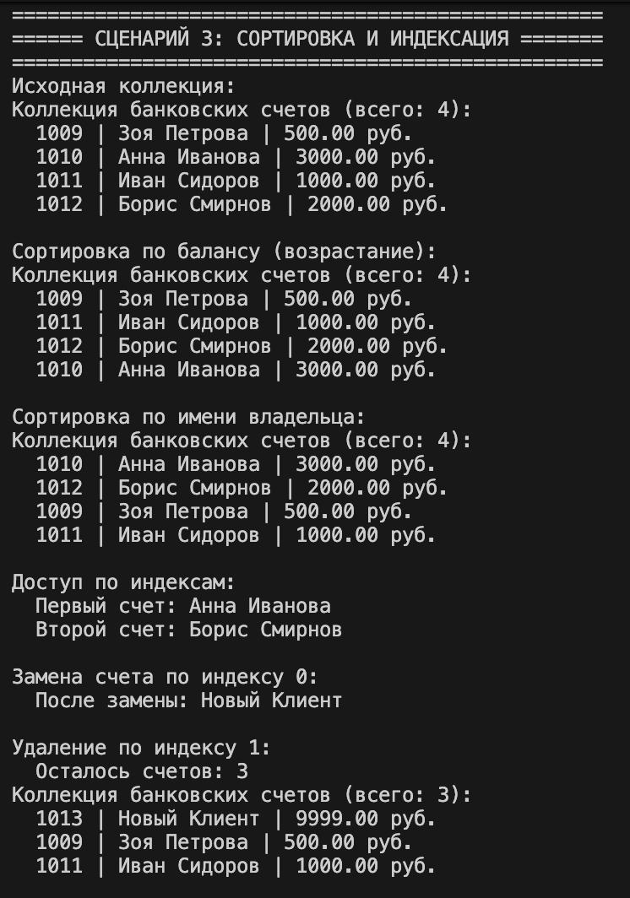
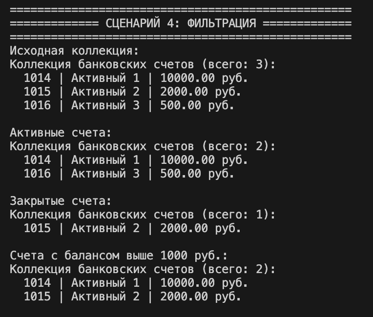

# Лабораторная работа 2
## Тема
Коллекция объектов — управление банковскими счетами

## Цель работы
Научиться работать с коллекциями объектов, реализовать собственный контейнерный класс с итерацией, индексацией, сортировкой и фильтрацией.

## Описание файлов лабораторной работы

### model.py 
**`model.py`** — класс `BankAccount` из первой лабораторной работы. Содержит закрытые атрибуты, свойства, бизнес-методы и магические методы.

### validate.py
**`validate.py`** — модуль валидации данных (из первой лабораторной). Содержит классы `Validator` и `TransactionValidator`.

### collection.py
**`collection.py`** — контейнерный класс `BankAccountCollection`, который управляет множеством объектов `BankAccount`. Реализует:
- Добавление, удаление, поиск
- Магические методы `__len__`, `__iter__`, `__getitem__`, `__setitem__`
- Сортировку и фильтрацию коллекции

### demo.py
**`demo.py`** — демонстрационный файл, содержащий 4 сценария, которые показывают все возможности контейнерного класса.

## Демонстрационные сценарии

## Сценарий 1: Базовые операции с коллекцией
**Функция в demo.py:** `scenario_1_basic_operations()`

Демонстрируется работа с коллекцией:
- Добавление объектов (`add`)
- Удаление объекта (`remove`)
- Получение всех элементов (`get_all`)
- Проверка на дубликаты и тип добавляемых объектов

### Теория к сценарию:

**Контейнерный класс** — это класс, предназначенный для хранения и управления группой однотипных объектов. Внутри он обычно использует встроенную коллекцию (например, список) и предоставляет методы для добавления, удаления, поиска.

**Проверка типа** — важный элемент контейнера: метод `add` должен убедиться, что добавляемый объект принадлежит нужному классу (в нашем случае `BankAccount`). Это предотвращает загрязнение коллекции посторонними данными.

**Контроль дубликатов** — в зависимости от бизнес-логики, контейнер может запрещать добавление объекта, уже присутствующего в коллекции. В нашей реализации дубликат определяется по уникальному номеру счета (`account_number`).

**Удаление объекта** может происходить по ссылке на сам объект (метод `remove`) или по индексу (метод `remove_at`).

## Сценарий 2: Поиск и итерация
**Функция в demo.py:** `scenario_2_search_and_iteration()`

Демонстрируется:
- Поиск по имени владельца (`find_by_owner_name`)
- Поиск по диапазону баланса (`find_by_balance_range`)
- Использование `len()` для получения размера коллекции
- Итерация по коллекции с помощью цикла `for`

### Теория к сценарию:

**Магический метод `__len__`** — вызывается функцией `len()`. Возвращает количество элементов в контейнере. Это делает использование контейнера интуитивно понятным.

**Магический метод `__iter__`** — возвращает итератор, позволяя обходить элементы коллекции в цикле `for`. Без этого метода пришлось бы писать `for i in range(len(collection))` и обращаться по индексу.

**Методы поиска** — реализуют фильтрацию элементов по заданным критериям. Они не изменяют саму коллекцию, а возвращают новый список (или новую коллекцию) с отобранными объектами. Частичное совпадение при поиске по имени делает поиск более гибким.

## Сценарий 3: Сортировка и индексация
**Функция в demo.py:** `scenario_3_sorting_and_indexing()`

Демонстрируется:
- Сортировка по балансу (`sort_by_balance`)
- Сортировка по имени владельца (`sort_by_owner_name`)
- Доступ к элементам по индексу (`collection[0]`, `collection[1]`)
- Замена элемента по индексу (`__setitem__`)
- Удаление по индексу (`remove_at`)

### Теория к сценарию:

**Индексация (`__getitem__`)** — позволяет обращаться к элементам коллекции через квадратные скобки, как к обычному списку. Это ключевой метод для создания «спископодобных» контейнеров. Он также может поддерживать срезы (slice), если это необходимо.

**Замена по индексу (`__setitem__`)** — даёт возможность изменять элемент коллекции по индексу, сохраняя при этом контроль над типом нового значения.

**Сортировка** — может быть реализована как отдельные методы для каждого критерия (например, `sort_by_balance`) или как универсальный метод `sort(key, reverse)`, принимающий пользовательскую функцию для извлечения ключа. Сортировка изменяет порядок элементов внутри существующей коллекции.

## Сценарий 4: Фильтрация и логические операции
**Функция в demo.py:** `scenario_4_filtering()`

Демонстрируется:
- Получение коллекции активных счетов (`get_active`)
- Получение коллекции закрытых счетов (`get_closed`)
- Получение коллекции счетов с балансом выше заданной суммы (`get_with_balance_above`)

### Теория к сценарию:

**Фильтрация** — это создание новой коллекции, содержащей только те элементы исходной коллекции, которые удовлетворяют определённому условию. В отличие от поиска, который может возвращать список, фильтрация возвращает объект того же контейнерного типа, что позволяет строить цепочки операций.

**Логические операции над коллекциями** — методы типа `get_active()` и `get_closed()` показывают, как можно получать разные «срезы» данных в зависимости от состояния объектов (например, статус счета).

**Новая коллекция** — все фильтрующие методы возвращают новый экземпляр `BankAccountCollection`, не изменяя исходный. Это соответствует принципу неизменяемости (immutability) и позволяет безопасно работать с подмножествами данных.

## Общая теория

### Контейнерные классы
Контейнер (коллекция) — это объект, предназначенный для хранения и управления группой других объектов. В Python встроенными контейнерами являются списки, словари, множества. Но часто требуется создать собственный контейнер с ограничениями на тип элементов, дополнительной бизнес-логикой или специфическими методами поиска.

### Итерация
Итерация — это процесс последовательного перебора элементов коллекции. Реализуется методом `__iter__`, который возвращает итератор. Благодаря этому объект становится итерируемым (iterable), и его можно использовать в цикле `for`, а также в функциях `list()`, `sum()` и других, ожидающих итерируемый объект.

### Индексация и срезы
Метод `__getitem__` позволяет обращаться к элементам по индексу (начиная с 0). При передаче среза (slice) он может вернуть новую коллекцию, содержащую подмножество элементов. `__setitem__` позволяет изменять элемент по индексу.

### Сортировка
Сортировка коллекции может выполняться двумя способами:
- **In-place** — изменяет порядок элементов внутри существующего контейнера (например, `list.sort()`)
- **Возврат новой коллекции** — оставляет исходную неизменной и возвращает отсортированную копию

В нашей реализации используется in-place сортировка, так как методы `sort_by_*` изменяют внутренний список.

### Фильтрация
Фильтрация — это операция выбора элементов, удовлетворяющих предикату. Результатом обычно является новая коллекция того же типа. Это позволяет применять цепочки фильтров: `collection.get_active().get_with_balance_above(1000)`.

## Вывод
В ходе лабораторной работы реализован контейнерный класс `BankAccountCollection`, который позволяет:
- Хранить и управлять объектами `BankAccount`
- Добавлять, удалять, искать элементы
- Итерировать по коллекции с помощью `for`
- Обращаться к элементам по индексу
- Сортировать по разным критериям
- Фильтровать коллекцию с получением новых коллекций

Создано 4 демонстрационных сценария, каждый из которых показывает определённый аспект работы контейнера:
1. **Базовые операции** — добавление, удаление, контроль типа и дубликатов
2. **Поиск и итерация** — методы поиска, `len()`, цикл `for`
3. **Сортировка и индексация** — сортировка, доступ и замена по индексу, удаление по индексу
4. **Фильтрация** — получение подколлекций по состоянию и балансу

Все требования лабораторной работы выполнены, цели достигнуты.