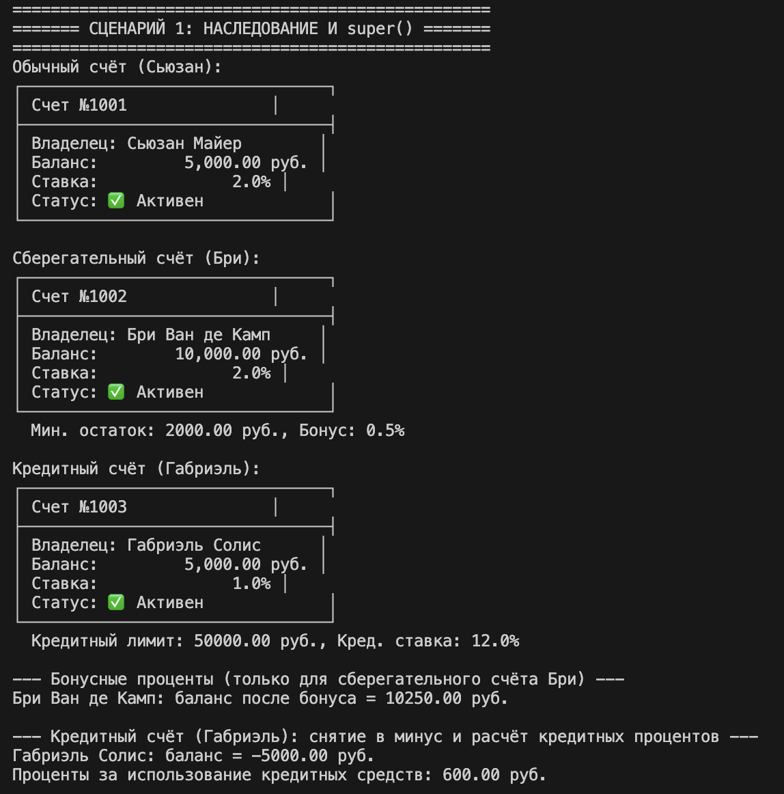
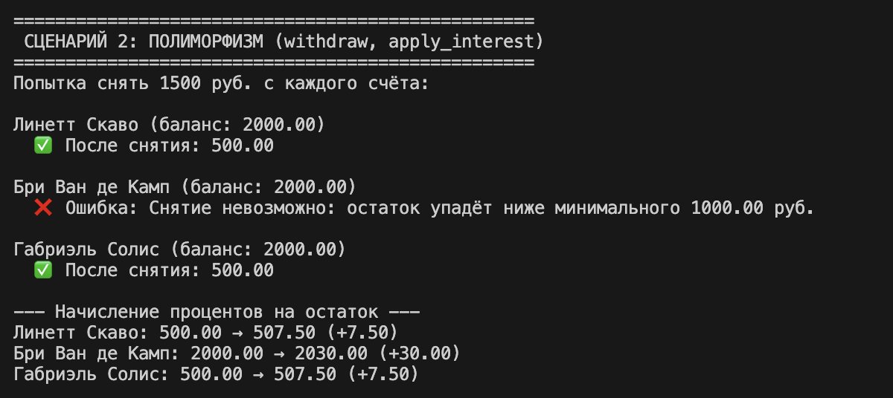
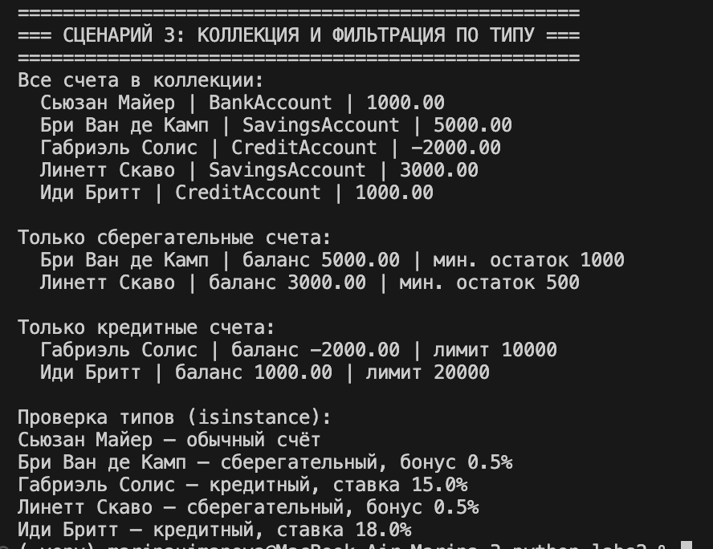

# Лабораторная работа 3
## Тема
Наследование и иерархия классов – банковские счета

## Цель работы
Освоить механизм наследования классов, научиться строить иерархию объектов, переиспользовать код, переопределять методы и реализовывать полиморфизм.

## Описание файлов лабораторной работы

### base.py
Файл-посредник, который импортирует класс `BankAccount` из ЛР-1. Не создаёт новый класс, а только даёт удобный доступ к базовому классу для наследования.

### models.py
Содержит производные классы:
- `SavingsAccount` (сберегательный счёт) – добавляет атрибуты `_min_balance` (минимальный остаток) и `_interest_bonus` (бонус к ставке), а также метод `apply_bonus_interest()`.
- `CreditAccount` (кредитный счёт) – добавляет атрибуты `_credit_limit` (кредитный лимит) и `_credit_rate` (ставка по овердрафту), а также метод `calculate_credit_interest()`.

Оба класса переопределяют метод `withdraw()`, реализуя разное поведение снятия средств.

### demo.py
Демонстрационный файл, содержащий 3 сценария, которые показывают:
- наследование и использование `super()`
- полиморфное поведение методов `withdraw()` и `apply_interest()`
- интеграцию с коллекцией из ЛР-2 и фильтрацию объектов по типу

## Демонстрационные сценарии

## Сценарий 1: Наследование и super()
**Функция в demo.py:** `scenario_1_inheritance()`

Демонстрируется:
- создание объектов базового и производных классов
- вызов конструктора базового класса через `super()`
- использование новых методов `apply_bonus_interest()` и `calculate_credit_interest()`

### Теория к сценарию:

**Наследование** – механизм, позволяющий создать новый класс на основе существующего. Дочерний класс автоматически получает все атрибуты и методы родительского, что обеспечивает переиспользование кода.

**`super()`** – функция, которая вызывает метод родительского класса. В конструкторе `SavingsAccount` и `CreditAccount` `super().__init__(...)` инициализирует общие поля (`owner_name`, `balance`, `interest_rate`), а затем добавляются специфические атрибуты.

## Сценарий 2: Полиморфизм
**Функция в demo.py:** `scenario_2_polymorphism()`

Демонстрируется:
- одинаковый вызов `withdraw(1500)` для разных типов счетов – разное поведение
- одинаковый вызов `apply_interest()` – работает согласно базовой логике (но может быть переопределён)
- обработка ошибок (сберегательный счёт не даёт опуститься ниже минимального остатка)

### Теория к сценарию:

**Полиморфизм** – способность объектов с одинаковым интерфейсом иметь различную реализацию. В примере метод `withdraw` переопределён в каждом дочернем классе:
- в `SavingsAccount` – запрещает снятие, если баланс станет ниже `_min_balance`
- в `CreditAccount` – позволяет уходить в минус до `_credit_limit`
- в базовом `BankAccount` – обычное снятие с проверкой достаточности средств

При вызове `acc.withdraw(amount)` Python автоматически выбирает нужную версию метода в зависимости от реального типа объекта.

## Сценарий 3: Интеграция с коллекцией и фильтрация по типу
**Функция в demo.py:** `scenario_3_collection_and_filtering()`

Демонстрируется:
- добавление в коллекцию объектов разных типов (`BankAccount`, `SavingsAccount`, `CreditAccount`)
- фильтрация коллекции по типу (получение только сберегательных или только кредитных счетов)
- использование `isinstance()` для проверки типа объектов

### Теория к сценарию:

**Коллекция из ЛР-2** – `BankAccountCollection` – благодаря полиморфизму может хранить любые объекты, являющиеся наследниками `BankAccount`. Это позволяет единообразно управлять счетами разных типов.

**Фильтрация по типу** – создание новой коллекции, содержащей только объекты определённого класса (например, только `SavingsAccount`). Реализована через функцию `filter_to_new_collection`, которая использует `isinstance()`.

**`isinstance()`** – встроенная функция, проверяющая, принадлежит ли объект указанному классу (или его наследникам). Позволяет безопасно разделять логику для разных типов.

## Общая теория

### Наследование
Позволяет создавать иерархии классов, где дочерние классы расширяют или изменяют поведение родительских. Основные преимущества:
- повторное использование кода
- логическая организация
- возможность полиморфизма

### Переопределение методов
Дочерний класс может заменить реализацию метода родителя. Для этого в дочернем классе определяется метод с тем же именем. Вызов родительской версии возможен через `super()`.

### Полиморфизм
Один интерфейс – множество реализаций. Позволяет писать обобщённый код, работающий с объектами разных классов единообразно.

### Интеграция с коллекцией
Благодаря полиморфизму коллекция, написанная для базового класса, автоматически работает со всеми наследниками. Это демонстрирует принцип подстановки Барбары Лисков (LSP).

## Вывод
В ходе лабораторной работы построена иерархия классов на основе `BankAccount` из ЛР-1. Реализованы два производных класса – `SavingsAccount` и `CreditAccount` – с дополнительными атрибутами и методами. Продемонстрировано наследование через `super()`, переопределение методов и полиморфное поведение. Интеграция с коллекцией из ЛР-2 показала, что контейнер может единообразно работать с объектами разных типов, а фильтрация по типу позволяет выделять подмножества. Все требования лабораторной работы выполнены, цели достигнуты.