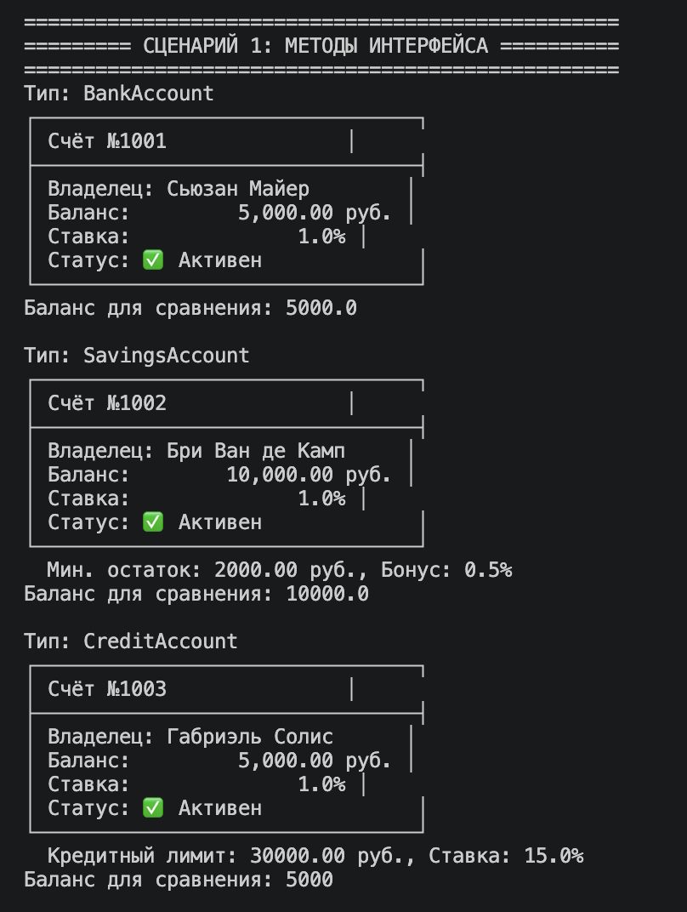
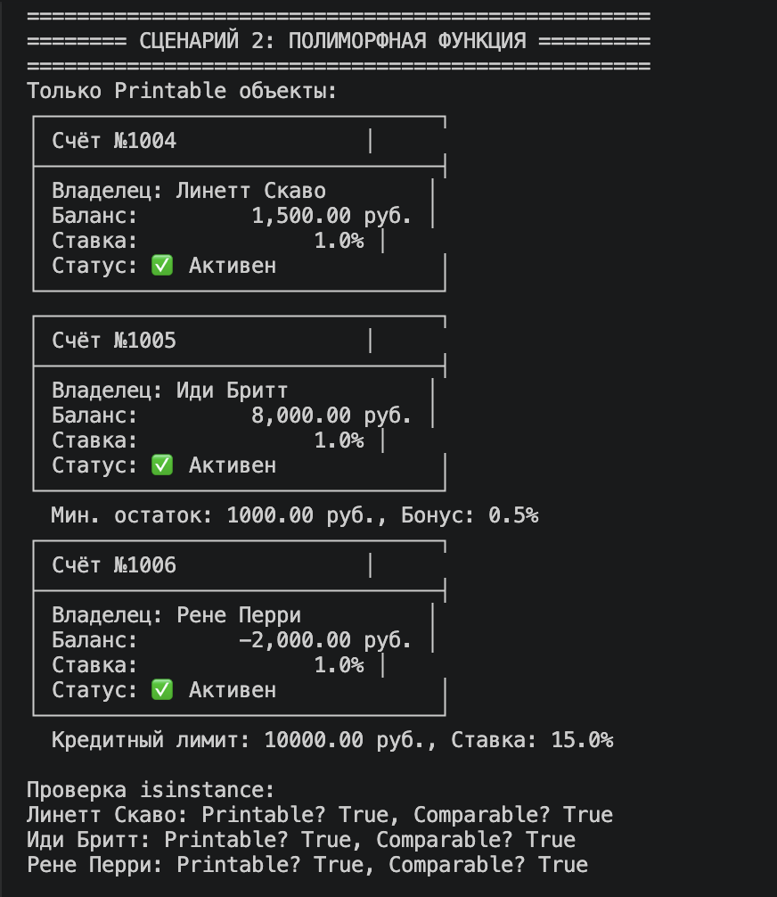
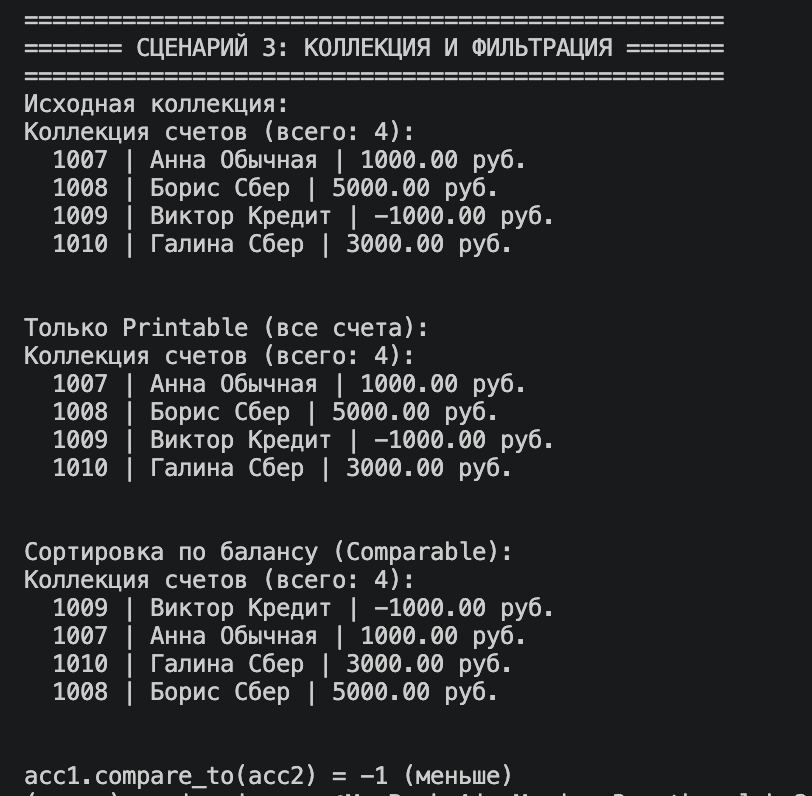

# Лабораторная работа 4 – Интерфейсы и абстрактные классы

## Цель работы
Познакомиться с абстрактными базовыми классами (ABC), освоить понятие интерфейса (контракта поведения), научиться задавать обязательные методы для классов, закрепить полиморфизм через единый интерфейс.

## Описание интерфейсов

В файле `interfaces.py` определены два интерфейса (абстрактных класса):

| Интерфейс | Абстрактный метод | Назначение |
|-----------|-------------------|------------|
| `Printable` | `to_string() -> str` | Возвращает строковое представление объекта |
| `Comparable` | `compare_to(other) -> int` | Сравнивает текущий объект с другим (отрицательное – меньше, 0 – равно, положительное – больше) |

## Реализация интерфейсов в классах

Классы `BankAccount`, `SavingsAccount` (сберегательный) и `CreditAccount` (кредитный) из файла `models.py` наследуют оба интерфейса и реализуют их методы:

- **`to_string()`** – вызывает магический `__str__`, который для каждого типа формирует строку с учётом специфических атрибутов (минимальный остаток, бонус, кредитный лимит и ставка).
- **`compare_to()`** – сравнивает два счёта по балансу (значение `balance`).

## Демонстрация (3 сценария)

### Сценарий 1: Вызов методов интерфейса

Создаются объекты трёх типов: обычный, сберегательный, кредитный. Для каждого вызывается `to_string()` через интерфейс `Printable`. Вывод показывает различное строковое представление – полиморфизм на практике.

**Демонстрируется:**
- Реализация `to_string()` в каждом классе с учётом его специфики (бонусы, лимиты).
- Полиморфный вызов метода через общий интерфейс `Printable` без проверки типа.
- Отсутствие `isinstance` – полиморфизм за счёт наследования интерфейса.
- Соблюдение контракта: все классы предоставляют метод `to_string()`.

### Сценарий 2: Полиморфная функция через интерфейс

Функция `print_all_printable(items: list[Printable])` принимает список объектов, реализующих `Printable`, и печатает их без проверки конкретного типа. В примере в списке смешаны объекты разных типов, а также посторонний объект (строка). С помощью `isinstance()` отбираются только печатаемые объекты, и функция успешно работает с ними.

Также с помощью `isinstance()` проверяется, реализуют ли объекты интерфейсы `Printable` и `Comparable`.

**Демонстрируется:**
- Использование интерфейса как типа параметра функции – программирование на уровне контрактов.
- Полиморфная функция, работающая с гетерогенной коллекцией (`BankAccount`, `SavingsAccount`, `CreditAccount`).
- Фильтрация объектов по интерфейсу через `isinstance()` для безопасного сбора печатаемых объектов.
- Проверка множественной реализации интерфейсов (оба интерфейса одновременно).
- Отсутствие условных операторов по типу – вся логика строится на вызове `to_string()`.

### Сценарий 3: Интеграция с коллекцией и фильтрация по интерфейсу

Создаётся коллекция `BankAccountCollection` (встроена в `demo.py`). В неё добавляются объекты разных типов. Затем:
- Исходная коллекция выводится на экран.
- Фильтрация: `filter_by_interface(coll, Printable)` возвращает новую коллекцию, содержащую только объекты, поддерживающие `Printable` (все счета).
- Сортировка коллекции по балансу (`sort_by_balance`).
- Вызов `compare_to` на двух отдельных счетах для демонстрации работы интерфейса `Comparable`.

**Демонстрируется:**
- Хранение в коллекции объектов разных типов, объединённых общим предком `BankAccount`.
- Фильтрация коллекции по интерфейсу с помощью `isinstance` – создание новой коллекции с объектами, обладающими нужным поведением.
- Полиморфизм при сортировке единообразная работа с атрибутом `balance` разных типов счетов.
- Использование метода `compare_to` из интерфейса `Comparable` для сравнения объектов по балансу.

## Вывод

В ходе лабораторной работы созданы интерфейсы (ABC) `Printable` и `Comparable`. Классы банковских счетов успешно их реализуют. Достигнут полиморфизм через единый контракт – единая функция `print_all_printable` работает с любым объектом, имеющим метод `to_string()`. Коллекция поддерживает фильтрацию объектов по интерфейсу. Все требования на оценки 3, 4 и 5 выполнены.