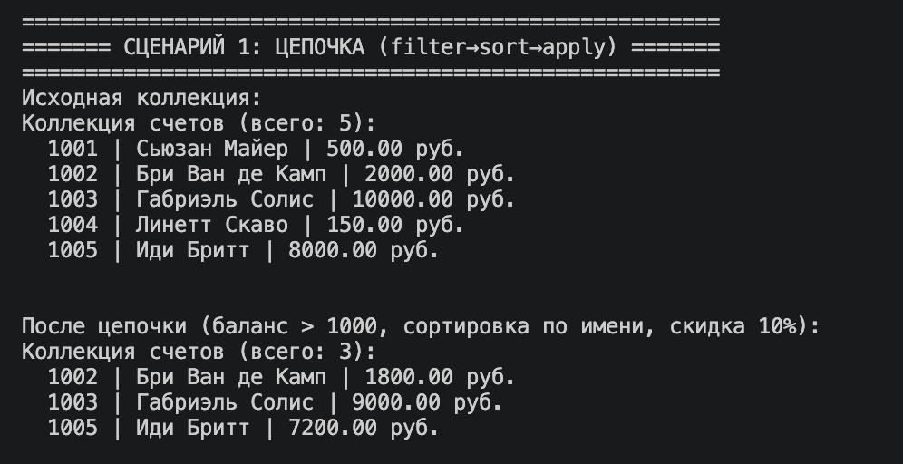
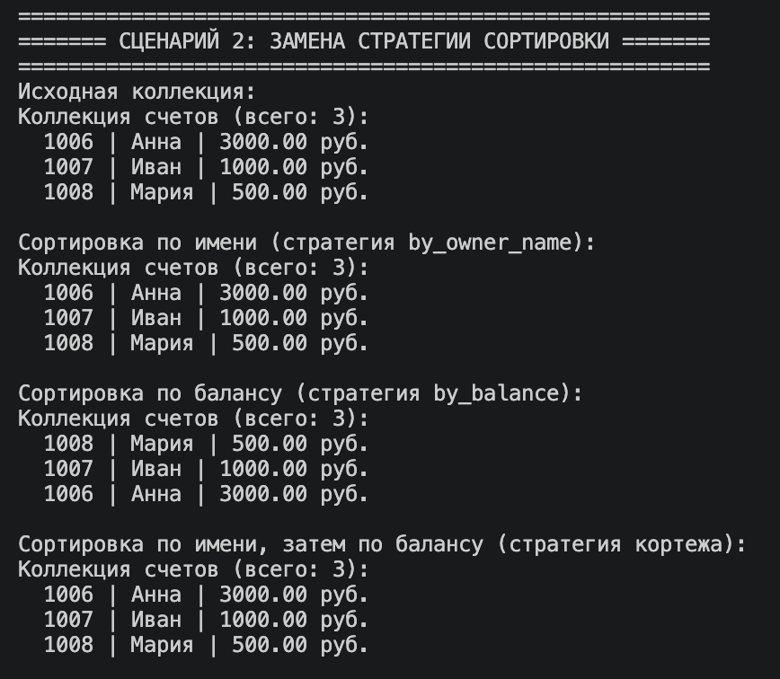
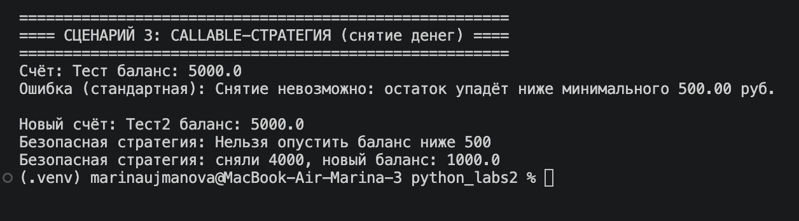

# Лабораторная работа 5 – Функции как аргументы. Стратегии и делегаты

## Цель работы
Освоить передачу функций как аргументов, использовать `map`, `filter`, `sorted`, реализовать паттерн «Стратегия» через `callable`-объекты, научиться строить цепочки операций над коллекцией.

## Реализованные функции и стратегии (файл `strategies.py`)

### Стратегии сортировки (key-функции)
- `by_owner_name` – сортировка по имени владельца
- `by_balance` – сортировка по балансу
- `by_owner_name_then_balance` – сортировка по имени, затем по балансу
- `by_account_number` – сортировка по номеру счёта

### Функции-фильтры и фабрики
- `is_balance_above(limit)` – фабрика: возвращает функцию, проверяющую баланс > limit
- `is_owner_contains(substring)` – фабрика: фильтр по вхождению подстроки в имя
- `is_savings_account`, `is_credit_account` – фильтры по типу объекта

### Функции преобразования (для map)
- `extract_owner_name`, `extract_balance` – извлечение полей
- `apply_discount(percent)` – фабрика: уменьшает баланс на процент
- `to_string_representation` – преобразование в строку

### Callable-стратегии (паттерн Стратегия)
- `StandardWithdrawStrategy` – обычное снятие средств
- `SafeWithdrawStrategy` – снятие с проверкой минимального остатка (для сберегательных счетов)

## Демонстрация (3 сценария)

### Сценарий 1: Цепочка операций (фильтр → сортировка → применение)

Методы `filter_by`, `sort_by`, `apply` возвращают `self` или новую коллекцию, что позволяет строить цепочки вызовов. Это демонстрирует функциональный стиль и гибкость: замена любого этапа (фильтра, сортировки, преобразования) не требует переписывания кода.

**Что происходит:**  
Создаётся коллекция из 5 счетов (обычные, сберегательные, кредитные). Применяется цепочка:  
1. Фильтр `is_balance_above(1000)` – оставляем счета с балансом > 1000 руб.  
2. Сортировка `by_owner_name` – по алфавиту.  
3. Применение `apply_discount(10)` – уменьшаем баланс на 10%.

После каждого шага коллекция изменяется, результат выводится.

---

### Сценарий 2: Замена стратегии сортировки без изменения кода коллекции

Метод `sort_by` принимает функцию, которая извлекает ключ сортировки. Это реализация паттерна «Стратегия»: поведение сортировки передаётся как аргумент и может быть заменено без изменения класса коллекции. Показана разница в порядке элементов при разных стратегиях.

**Что происходит:**  
Одна и та же коллекция (3 счета) сортируется тремя разными способами:  
- по имени владельца (`by_owner_name`)  
- по балансу (`by_balance`)  
- по кортежу (имя, баланс) – сортировка сначала по имени, затем по балансу.

Каждый раз результат выводится отдельно.

---

### Сценарий 3: Callable-стратегия (паттерн Стратегия)

`SafeWithdrawStrategy` и `StandardWithdrawStrategy` – классы с методом `__call__`. Они взаимозаменяемы, реализуют один интерфейс (`callable`). Это классический паттерн «Стратегия»: алгоритм (как снимать деньги) инкапсулирован в отдельном объекте и может быть подставлен без изменения кода самого счёта.

**Что происходит:**  
Создаётся сберегательный счёт с балансом 5000 руб. и минимальным остатком 500 руб.  
- `StandardWithdrawStrategy` – пытается снять 4700 руб. (успех, остаётся 300 руб.), затем снять 1000 руб. – ошибка «недостаточно средств».  
- `SafeWithdrawStrategy` – пытается снять 4700 руб. – ошибка, так как баланс (300) станет ниже минимального остатка (500).  
- Затем безопасная стратегия снимает 4000 руб. – успех, остаётся 1000 руб.

---

## Вывод

В ходе лабораторной работы:

- Реализованы функции-стратегии сортировки, фильтрации и преобразования.
- Класс коллекции расширен методами `sort_by`, `filter_by`, `apply`, поддерживающими цепочки операций.
- Применены `lambda`-функции и фабрики функций (замыкания).
- Реализован паттерн «Стратегия» через `callable`-объекты.
- В `demo.py` представлены три сценария, демонстрирующих все ключевые возможности.

