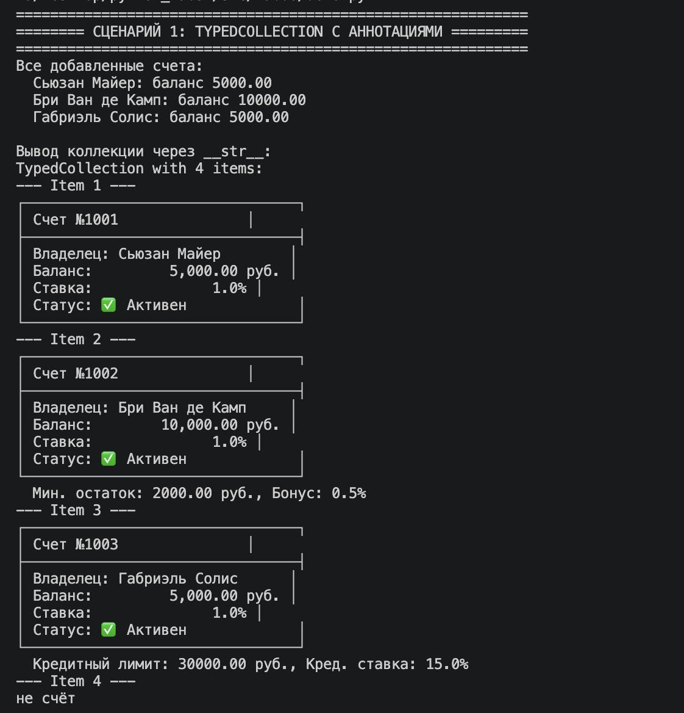
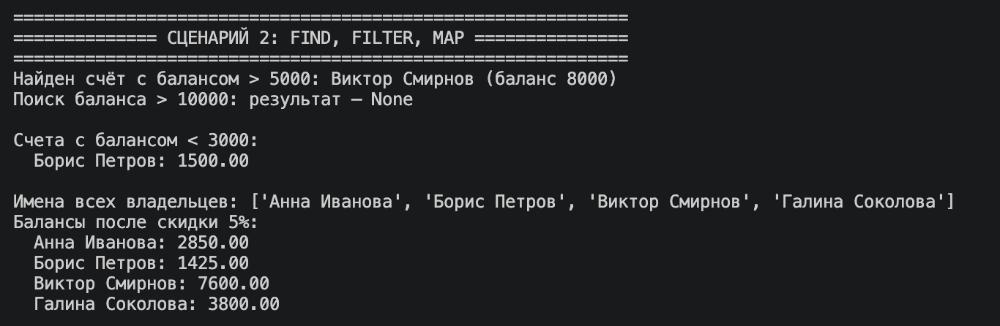
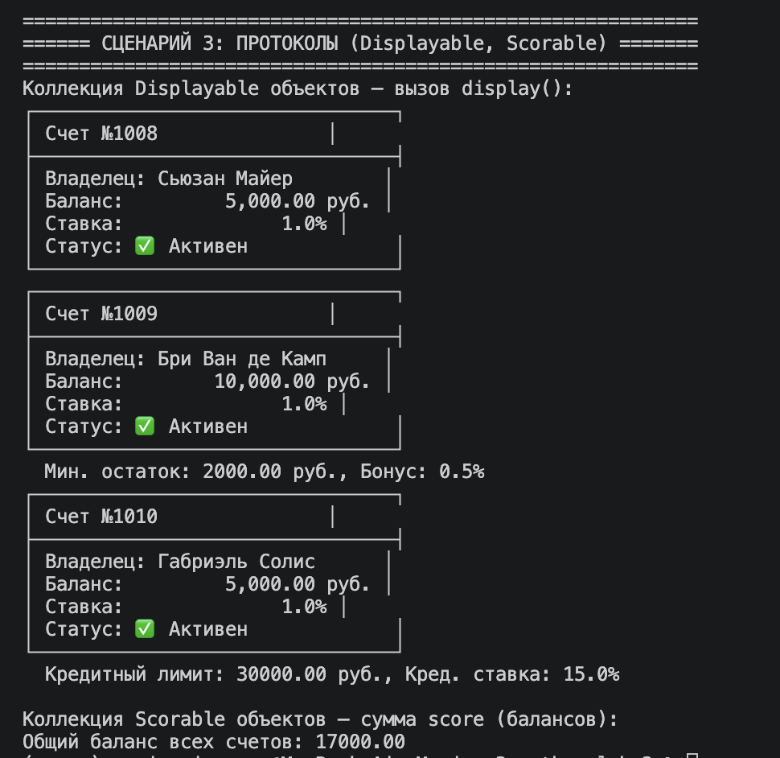

# Лабораторная работа 6 – Generics и typing

## Цель работы
Освоить аннотации типов, обобщённые классы (Generic), структурную типизацию через Protocol, научиться применять TypeVar с ограничениями и реализовать методы `find`, `filter`, `map` в generic-контейнере.

## Реализованные компоненты

### `TypedCollection[T]`
Generic-класс, хранящий элементы типа `T`. Поддерживает:
- `add(item: T)`, `remove(item: T)`, `get_all() -> list[T]`
- `find(predicate: Callable[[T], bool]) -> Optional[T]`
- `filter(predicate: Callable[[T], bool]) -> list[T]`
- `map(transform: Callable[[T], R]) -> list[R]` – результат может быть другого типа (второй TypeVar).

### Протоколы (структурная типизация)
- `Displayable` – требует метод `display() -> str`
- `Scorable` – требует метод `score() -> float`

### TypeVar с ограничениями
- `D = TypeVar('D', bound=Displayable)`
- `S = TypeVar('S', bound=Scorable)`

Классы `BankAccount`, `SavingsAccount`, `CreditAccount` из ЛР-3 **не наследуют** эти протоколы, но благодаря структурной типизации подходят, если добавить нужные методы (в демо используется monkey patching).

---

## Демонстрация (3 сценария)

### Сценарий 1: Базовая работа с Generic-коллекцией

**Теория:**  
Generic-класс `TypedCollection[T]` параметризуется типом элементов. При создании экземпляра указывается конкретный тип (например, `BankAccount`). Метод `add` проверяет тип добавляемого объекта во время выполнения и выбрасывает `TypeError`, если тип не совпадает. Метод `__str__` выводит коллекцию в читаемом виде.

**Что произошло:**  
Создана коллекция `TypedCollection[BankAccount]`. Добавлены три счёта – обычный, сберегательный и кредитный. При попытке добавить строку `"не счёт"` возникла ошибка `TypeError`, которая была перехвачена и выведена. Коллекция выведена через `__str__` – каждый элемент отделён заголовком `--- Item N ---`, строки представлены красиво.

---

### Сценарий 2: Методы `find`, `filter`, `map`

**Теория:**  
- `find` – принимает функцию-предикат, возвращает первый подходящий элемент или `None`. Полезен для поиска уникального объекта.
- `filter` – возвращает список всех элементов, удовлетворяющих условию.
- `map` – применяет функцию преобразования к каждому элементу, возвращает список результатов. Тип результата может отличаться от типа элемента (используется второй TypeVar `R`). Демонстрируется извлечение имён (тип `str`) и применение скидки (возвращаются изменённые объекты того же типа).

**Что произошло:**  
В коллекцию добавлены 4 счёта. `find` нашёл счёт с балансом > 5000 (Виктор Смирнов, 8000). Поиск баланса > 10000 вернул `None`. `filter` отобрал счета с балансом < 3000 (Борис Петров, 1500). `map` сначала извлёк имена владельцев в список строк, затем применил скидку 5% ко всем балансам, вернув модифицированные объекты. Выведены результаты каждого этапа.

---

### Сценарий 3: Протоколы и TypeVar с ограничениями

**Теория:**  
Протоколы задают структурный интерфейс: объект считается `Displayable`, если у него есть метод `display()`, и `Scorable` – если есть `score()`. TypeVar с `bound` ограничивает допустимые типы теми, которые соответствуют протоколу. Это позволяет создавать коллекции только для объектов, способных отображать себя (`TypedCollection[D]`) или иметь числовую оценку (`TypedCollection[S]`). Классы банковских счетов не наследуют протоколы, но в демо им динамически добавляются методы `display` и `score` (monkey patching) – иллюстрация структурной типизации.

**Что произошло:**  
Создана коллекция `TypedCollection[D]` (D bound=Displayable). В неё добавлены три счёта – они автоматически удовлетворяют протоколу, так как имеют метод `display()`. Вызов `display()` для каждого напечатал строковое представление. Создана коллекция `TypedCollection[S]` (S bound=Scorable). Добавлены три счёта с разными балансами (включая отрицательный). С помощью `score()` извлечены числовые значения и вычислена сумма балансов. Показано, что классы не наследуют протоколы, но структурно подходят.

---

## Вывод

В ходе лабораторной работы:
- Реализован generic-контейнер `TypedCollection[T]` с методами `find`, `filter`, `map` (два TypeVar).
- Добавлены аннотации типов к существующим классам (импортированным из ЛР-3).
- Созданы протоколы `Displayable` и `Scorable`, а также TypeVar с ограничением `bound`.
- Продемонстрирована структурная типизация: объекты удовлетворяют протоколу без явного наследования.
- Написаны три сценария, охватывающие все ключевые возможности.
