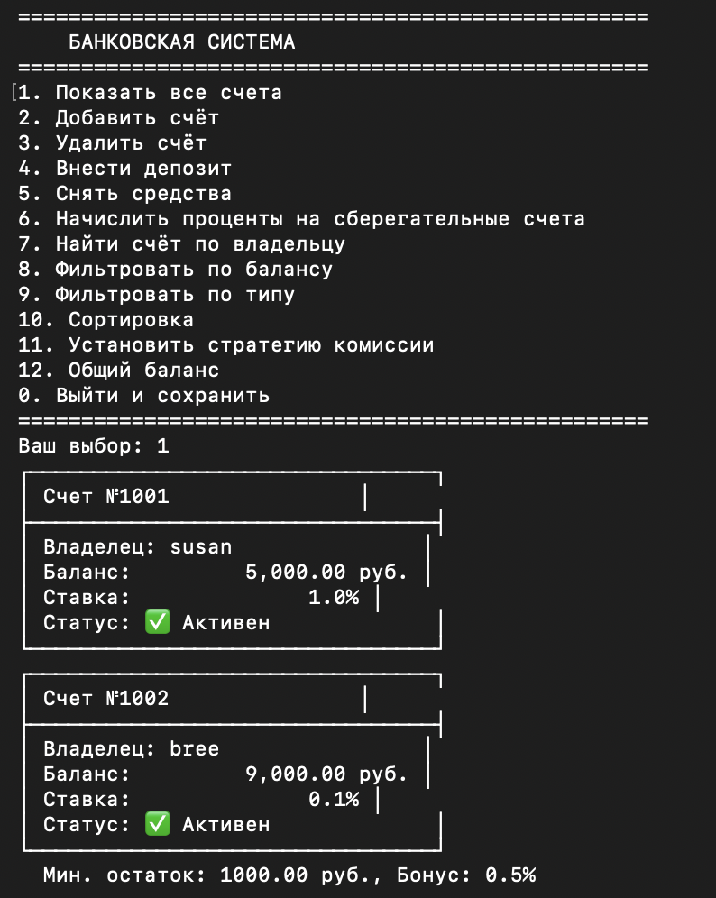
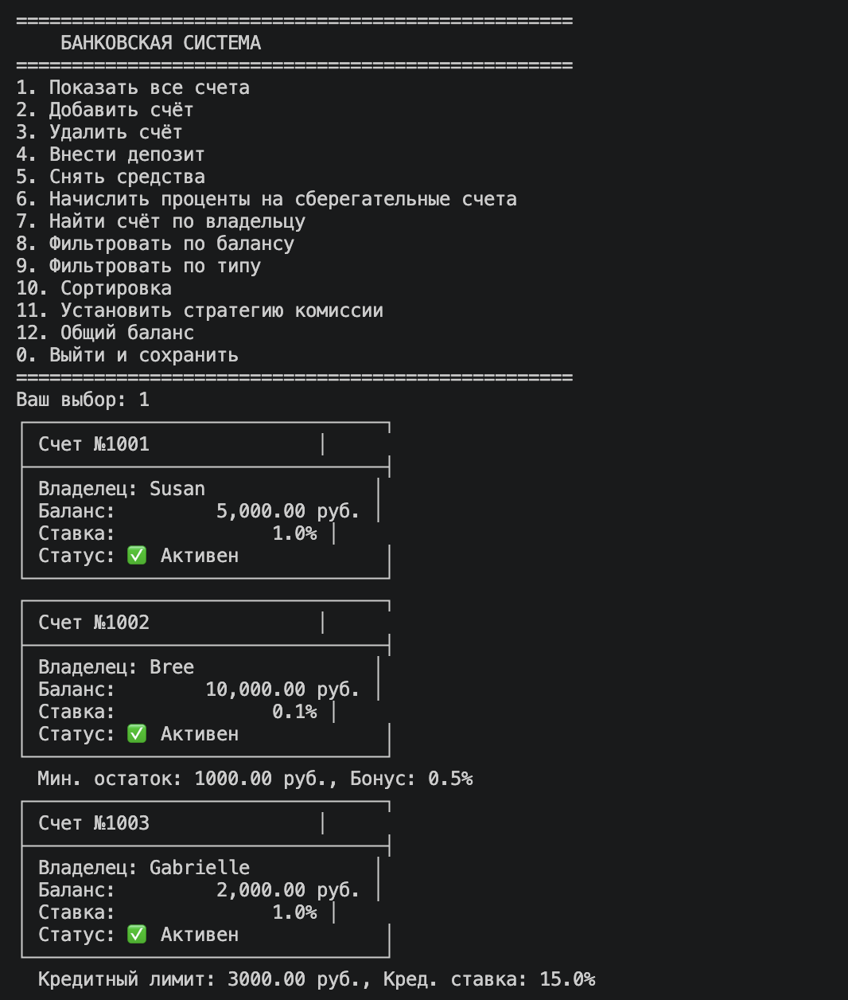
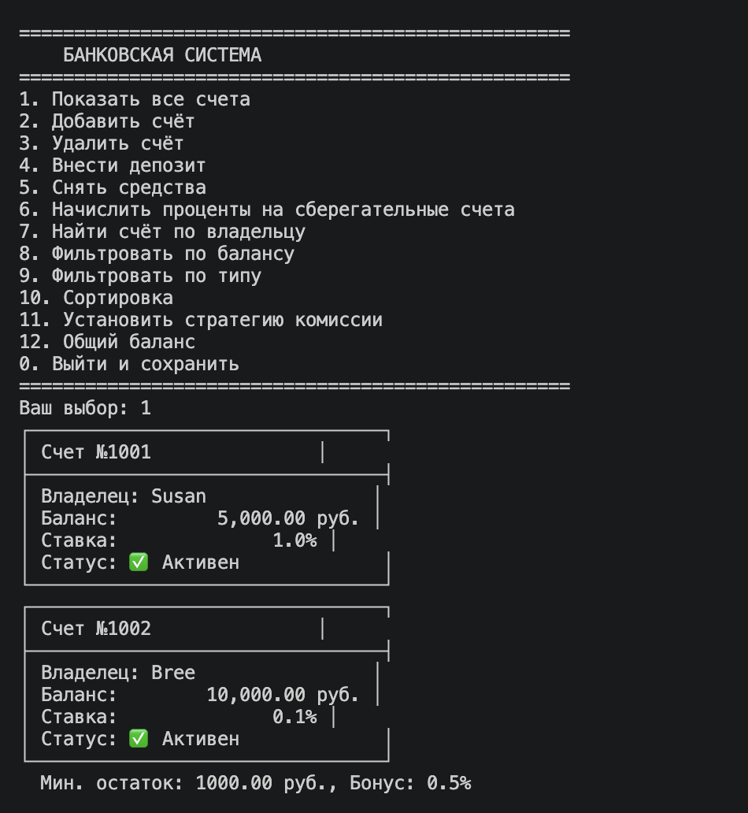
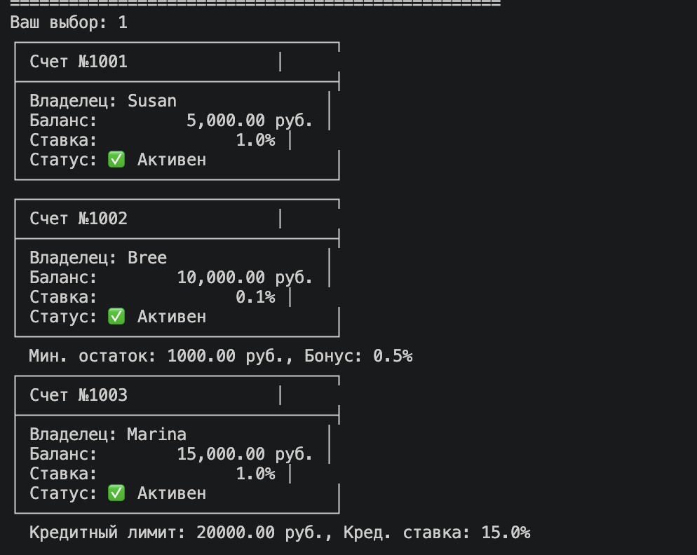
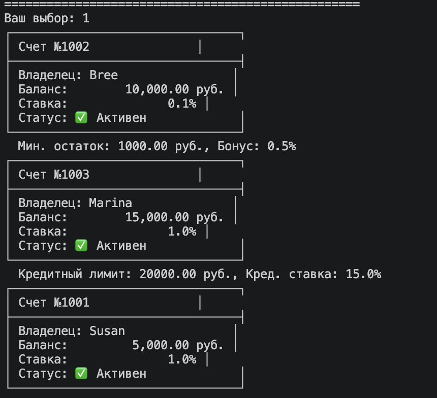
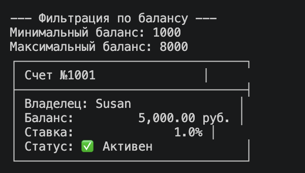
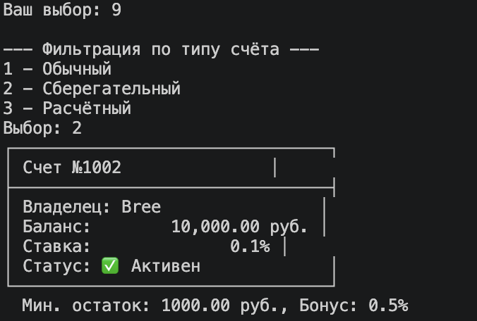
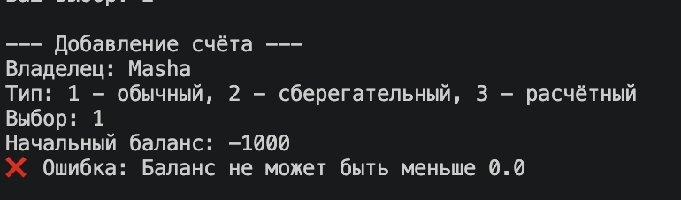

# ЛР-7 — Консольное приложение управления банковскими счетами

## 1. Цель работы

- Объединить все знания, полученные в ЛР1–ЛР6, в единое работающее приложение.
- Реализовать интерактивный CLI-интерфейс с меню и вводом пользователя.

**Применённые навыки:**
- ООП, наследование и инкапсуляция (классы BankAccount, SavingsAccount, CreditAccount)
- Коллекции и управление объектами (BankAccountCollection из ЛР-5)
- Интерфейсы и полиморфизм (стратегии комиссий)
- Функциональное программирование, стратегии сортировки и фильтрации
- Generics, typing и аннотации типов (ЛР-6)
- CLI-интерфейс, обработка исключений, работа с файлами JSON

---

## 2. Структура проекта
lab07/
├── main.py          # Точка входа, автозагрузка/сохранение данных
├── cli.py           # CLI-интерфейс: меню, ввод/вывод, форматирование
├── app.py           # Бизнес-логика: CRUD, поиск, фильтрация, сортировка, стратегии комиссий
├── exceptions.py    # Пользовательские исключения
├── storage.py       # Сохранение и загрузка данных в JSON
└── bank_data.json   # Файл с сохранёнными данными счетов (создаётся автоматически)

### Назначение файлов:

| Файл | Назначение |
|------|------------|
| `main.py` | Точка входа. Загружает данные из JSON (если есть), инициализирует приложение, запускает CLI, при выходе сохраняет данные. |
| `cli.py` | Консольный интерфейс. Только ввод/вывод. Форматирует вывод, обрабатывает ошибки ввода (не число, пустая строка), запрашивает подтверждение удаления. |
| `app.py` | Бизнес-логика. Управляет коллекцией `BankAccountCollection` (импортированной из `lab05`), реализует добавление, удаление, поиск, фильтрацию, сортировку, стратегии комиссий (классы `NoFee`, `FlatFee`, `PercentFee`, `TieredFee`). |
| `exceptions.py` | Пользовательские исключения: `ItemNotFoundError`, `DuplicateItemError`, `InvalidInputError`. |
| `storage.py` | Низкоуровневые функции чтения/записи JSON-файла, преобразование объектов в словари и обратно. |
| `bank_data.json` | Файл данных. При первом запуске создаётся автоматически. |

**Импорты из предыдущих лабораторных:**
- `lab03.models` – классы `BankAccount`, `SavingsAccount`, `CreditAccount`
- `lab05.collection` – класс `BankAccountCollection` (с методами `find`, `filter_by`, `sort_by`, `apply`)

---

## 3. Описание CLI

### Главное меню

1. Показать все счета

2. Добавить счёт

3. Удалить счёт

4. Внести депозит

5. Снять средства

6. Начислить проценты на сберегательные счета

7. Найти счёт по владельцу

8. Фильтровать по балансу

9. Фильтровать по типу

10. Сортировка

11. Установить стратегию комиссии

12. Общий баланс

0. Выйти и сохранить

### Реализованные пункты меню:

1. **Показать все счета** — выводит список счетов с использованием `__str__` каждого объекта.
2. **Добавить счёт** — выбор типа (обычный, сберегательный, расчётный), ввод владельца, баланса, а для сберегательного – процентной ставки (0–10%), для расчётного – лимита овердрафта. Проверка на дубликат (владелец + тип) через `DuplicateItemError`.
3. **Удалить счёт** — поиск по владельцу, запрос подтверждения `y/n`, удаление через `remove_account`.
4. **Внести депозит** — поиск счёта по владельцу, увеличение баланса на введённую сумму.
5. **Снять средства** — поиск счёта, проверка возможности снятия (учитывается овердрафт для расчётного счёта), списание комиссии согласно установленной стратегии.
6. **Начислить проценты** — для всех сберегательных счетов вызывается `apply_interest()`.
7. **Найти счёт по владельцу** — вывод информации о найденном счёте.
8. **Фильтровать по балансу** — ввод минимальной и максимальной суммы, вывод счетов, попадающих в диапазон.
9. **Фильтровать по типу** — подменю: обычный, сберегательный, расчётный. Вывод только счетов выбранного типа.
10. **Сортировка** — подменю с выбором критерия: по балансу (возр./убыв.), по владельцу (возр./убыв.), по типу + балансу.
11. **Установить стратегию комиссии** — выбор счёта по владельцу, затем выбор стратегии: нет комиссии, фиксированная комиссия, процентная комиссия (0–100%).
12. **Общий баланс** — сумма балансов всех счетов.
0. **Выйти и сохранить** — предложение сохранить данные перед выходом (y/n). При положительном ответе данные записываются в `bank_data.json`.

### Обработка ошибок ввода:

- **Неверный пункт меню** — сообщение "Неверный пункт. Попробуйте снова."
- **Ввод строки вместо числа** – перехват `ValueError`, повторный запрос.
- **Пустой ввод** (имя владельца) – запрос повторного ввода.
- **Отрицательная сумма** – сообщение "Сумма должна быть положительной".
- **Дубликат счёта** – `DuplicateItemError` с указанием владельца.
- **Счёт не найден** – `ItemNotFoundError` с сообщением.
- **Некорректная процентная ставка** (не в 0..10) – `InvalidInputError`.

### Сохранение и загрузка данных:

- **Автозагрузка** при запуске: если файл `bank_data.json` существует, данные загружаются.
- **Автосохранение** при выходе: запрос подтверждения.
- **Ручное сохранение**: реализовано как часть выхода (нет отдельного пункта, но можно добавить; в текущей версии сохранение только при выходе).
- **Формат данных**: JSON, хранится тип счёта, владелец, баланс, а для сберегательного – процентная ставка, для расчётного – лимит овердрафта.

---

## 4. Демонстрация работы

### Сценарий 1: Запуск → автозагрузка (при повторном запуске) → вывод коллекции

*Запуск после предыдущего сохранения, счета загружены из JSON.*

### Сценарий 2: Добавление счетов → удаление с подтверждением → выход → повторный запуск

*Добавлены обычный, сберегательный и расчётный счета; затем удалён расчётный счёт с подтверждением; после выхода и повторного запуска он отсутствует.*

### Сценарий 3: Сортировка с выбором стратегии

*Сортировка по балансу (возрастание) и по имени владельца (алфавитный порядок).*

### Сценарий 4: Фильтрация + перехват исключений

*Фильтрация по диапазону баланса (1000–8000), фильтр по типу (сберегательные). Также показана попытка добавить счет с отрицательным балансом.*

### Видеозапись демонстрации (asciinema)

> Ссылка содержит запись основных сценариев в интерактивном режиме.

---

## 5. Вывод

В ходе выполнения лабораторной работы были изучены и применены на практике:

- **Разбиение на модули и слои** – архитектура из 5 модулей с чётким разделением ответственности: CLI (ввод/вывод), App (бизнес-логика), Storage (работа с файлами), Exceptions (собственные исключения).
- **CLI-интерфейс** – реализация интерактивного консольного меню с валидацией ввода, форматированным выводом, подтверждением опасных операций.
- **Обработка исключений** – иерархия пользовательских исключений, перехват и обработка на уровне CLI с понятными сообщениями.
- **Работа с файлами** – сериализация коллекции в JSON, автоматическая загрузка при старте, сохранение при выходе с подтверждением.
- **Типизация** – аннотации типов у всех публичных методов и функций, docstring-комментарии.
- **Паттерны проектирования** – Стратегия (комиссии, сортировка), Фабрика (стратегии комиссий), внедрение зависимостей.
